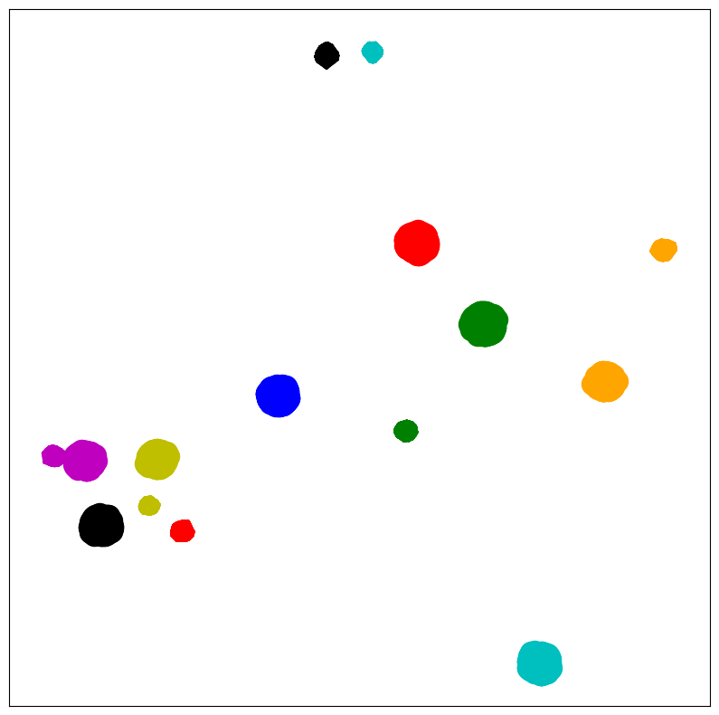
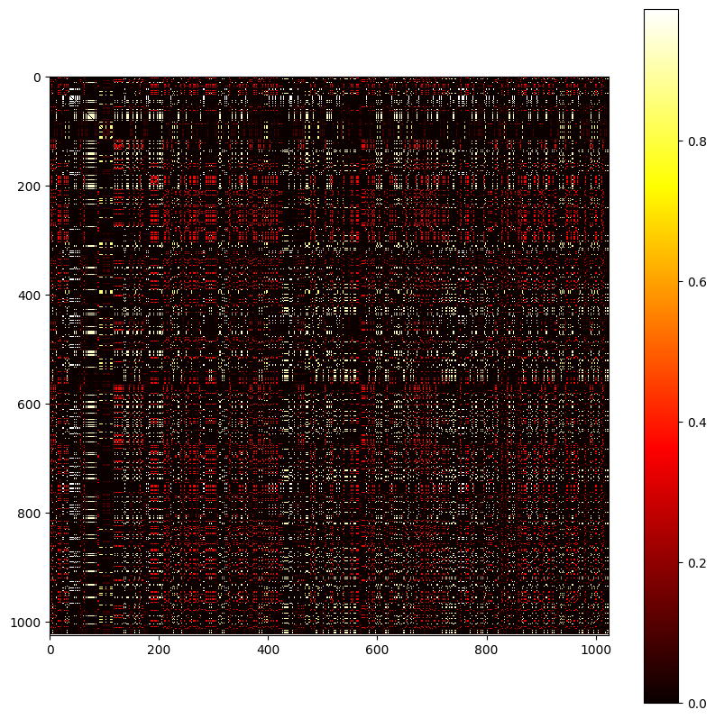

# NEU_NLP_AccerateviaMoE

东北大学暑期实训项目代码

由刘小龙、杨森、郭奥博、季晔完成

使用MoE进行加速推理。本项目基于前馈神经网络FFN层的稀疏性，划分出8个专家，训练出一个专家网络来选择激活不同的专家，直观感受激活不同专家数目能够加速的时间。

补全数据和权重文件，运行Liu.py，即可对比加速前后的时间。

## 原有模型

我们选择的Transformer模型已实现一些基础功能。该模型被应用于执行德语到英语的机器翻译任务，主要目标是将输入的德语句子翻译成英语。

模型采用Beam Search（束搜索）策略，这是一种启发式搜索策略，它在每一步选择概率最高的k个选项（k为束宽），然后在下一步从这k个选项中选择概率最高的k个结果，依此类推。这种方式可以在一定程度上解决贪婪搜索只能得到局部最优解的问题，从而提高翻译的准确性。

对于每一个德语句子，使用Beam Search找出k个最可能的英语翻译结果。然后计算每个翻译结果的BLEU分数，并输出平均的BLEU分数，以评估模型的翻译质量。

### 稀疏性验证

在FFN层修改forward方法，记录为负值的神经元，计算比率，发现在Encoder中大约90%的神经元未被激活，在Decoder中大约80~90%的神经元未被激活。
对比MoEfication可以有条件地使用10% ~ 30%的FFN参数，同时保持95%以上的原始性能，也就是他们的专家系统挑选出了这些工作的神经元（占原来的10~30%），进而达到相近的性能。

## Poster

## 文件结构

    NEU_NLP_AccerateviaMoE/
    |- controlNN/ # 训练门控网络
    |   |- model/
    |   |- utils/
    |   |- weights/
    |- Liu.py # 对比前后模型的加速效果
    |- data/ # 德英翻译数据集
    |- data4Gate # 训练门控网络（controlNN）的数据
    |- Expert/
    |- model/
    |- utils/
    |- tool/
    |- save/

## 专家划分方法探索

### 共激活图法

为每个FFN建立了一个共激活图，其中节点是神经元，边缘权值被设置为两个神经元共同激活的次数。然后，我们通过图的划分将这个图划分为几个具有很强内部连接的子图（Karypis和Kumar，1998），并将每个子图视为专家。

根据神经元的共激活图可以划分出一些专家。

### 聚类法

基于相似的向量运算后的结果也相似的数学直觉，假设相似的神经元将同时被激活。考虑参数信息，将FFN中的W矩阵的列视为具有doddle维数的向量集合。然后，将平衡k-means应用到这个集合中，通过k个聚类来构造专家。但是我们的探究结果显示划分的效果不好，专家内部的联系并不强。

## 门控网络

门函数的输出决定了MoE模型的最终输出是专家的集成还是仅使用少数专家的输出结果，即MoE模型是一个稠密的集成模型还是一个稀疏模型。核心理念是用有限的专家提供尽可能多的激活的神经元。

可学习的门控函数为了实现这一目标，我们首先通过贪婪算法在训练数据上找到最佳选择(相当于我先构造数据集)，然后利用它们训练一个浅层网络作为专家路由器，基于隐层输入选择x专家。

通过输入一些测试样例，记录其词向量和在该层激活的专家标签号作为标签来构造数据集。

## 效果

| Data Number | 10    | 15    | 20    | 25    | 30    |
|-------------|-------|-------|-------|-------|-------|
| Origin-Time | 4.00  | 4.16  | 4.82  | 5.50  | 6.73  |
| Origin-Accuracy | 0.21 | 0.20 | 0.25 | 0.24 | 0.25 |
| 1MoE-Time   | 2.67  | 3.29  | 4.08  | 4.72  | 5.91  |
| 1MoE-Accuracy | 0.15 | 0.15 | 0.15 | 0.15 | 0.16 |
| 2MoE-Time   | 2.28  | 2.71  | 3.15  | 4.41  | 5.48  |
| 2MoE-Accuracy | 0.15 | 0.16 | 0.17 | 0.18 | 0.18 |
| 4MoE-Time   | 2.19  | 2.82  | 3.35  | 4.09  | 5.15  |
| 4MoE-Accuracy | 0.20 | 0.19 | 0.22 | 0.22 | 0.22 |
| 8MoE-Time   | 2.68  | 3.18  | 4.30  | 5.23  | 6.40  |
| 8MoE-Accuracy | 0.21 | 0.20 | 0.25 | 0.24 | 0.25 |

从表中可以看出，混合专家在损失一定精度的情况下，可以获得更好的性能。
