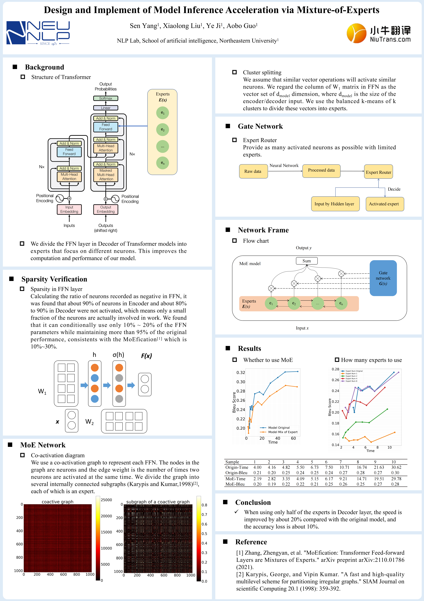
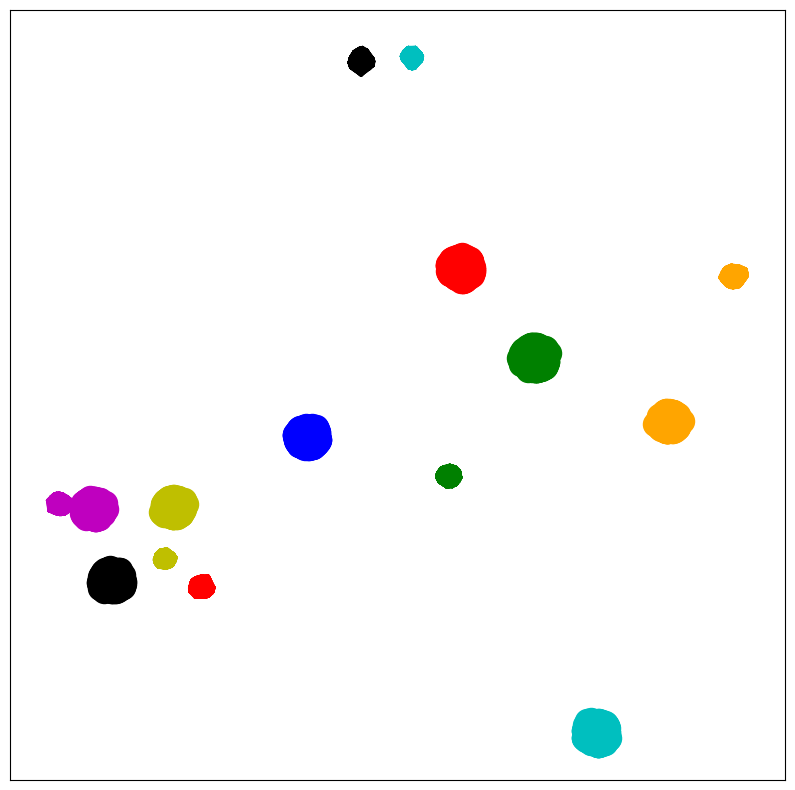
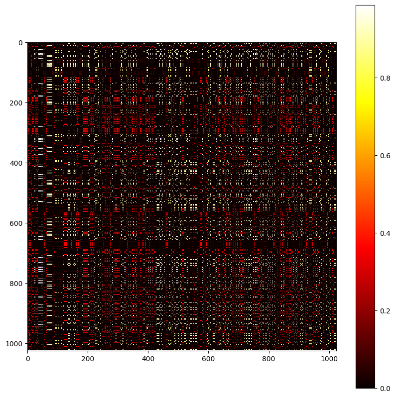

# NEU_NLP_AccerateviaMoE

东北大学暑期实训项目代码

[任务要求](./tasks.md)

由刘小龙、杨森、郭奥博、季晔完成

## 项目简介

本项目基于混合专家（Mixture-of-Experts, MoE）模型进行推理加速。通过利用Transformer中FFN层的稀疏激活特性，将原本的FFN层划分为多个专家网络，并训练门控网络来选择激活不同的专家，从而在保持模型性能的同时实现推理加速。

补全数据和权重文件后，运行`compare_models_gui.py`，即可对比加速前后的时间。

## 选题背景

混合专家(Mixture-of-Experts)的发展脉络可以追溯到上世纪90年代，由Jacobs等人提出。它的核心思想是将输入数据分配给不同的专家模型，每个模型专注于处理特定类型或特征的数据子集。这些专家模型可以是任何机器学习或统计模型，如神经网络。然后，通过一个门控模型来根据输入数据的特征选择合适的专家模型，并将它们的预测结果进行加权组合，生成最终的预测结果。

从如今关于多尺度模型和可解释性等研究中我们可以发现，对于模型的不同子结构，比如层或者分支可以学习到多种特征。这说明对一个既定目标，比如翻译，我们可以使用一种分治思想将原问题分解为多个子问题。

近年来，基于Transformers的预训练语言模型（PLMs）的规模呈指数级增长，但是根据我们对Transformer中FFN的观察，我们发现了一种稀疏激活的现象，即只有一小部分神经元为单个输入被激活。通过混和专家，将原本模型中的维度较宽一层的划分为多个维度较小的专家网络，可以有效地减少参数量，达到提高效率的目的。

## 模型结构

混合专家模型主要由两部分组成：专家网络（橙色）以及门控网络（蓝色），其计算可以被公式化为

$$
y = E(x) \cdot G(x) = \sum_{i}^{n} e_i(x)g_i(x)
$$

其中E()是专家网络的输出，G()是门控网络的输出，ei(x)和gi(x)则分别对应了专家和门控网络第i个位置的输出，并且门控网络和专家接收相同的输入。


MoE模型可以被视为一种带门控的多分支网络，其中每个分支都被称作一个专家，专家和门控网络接收相同的输入，每个专家学习不同的特征，门函数根据输入为每个专家分配不同的权重。从结构的角度来说，MoE模型有两个本质问题，分别为专家划分和专家选择。

## 原有模型

我们选择的Transformer模型已实现一些基础功能。该模型被应用于执行德语到英语的机器翻译任务，主要目标是将输入的德语句子翻译成英语。

模型采用Beam Search（束搜索）策略，这是一种启发式搜索策略，它在每一步选择概率最高的k个选项（k为束宽），然后在下一步从这k个选项中选择概率最高的k个结果，依此类推。这种方式可以在一定程度上解决贪婪搜索只能得到局部最优解的问题，从而提高翻译的准确性。

对于每一个德语句子，使用Beam Search找出k个最可能的英语翻译结果。然后计算每个翻译结果的BLEU分数，并输出平均的BLEU分数，以评估模型的翻译质量。

## 任务实现

### 任务1：稀疏性验证


对于隐层表示中负值的所对应那部分参数实际上并没有被激活，因为在经过激活函数之后被设置为0，那么这部分没有被激活的参数到底占据了百分之多少？

在FFN层修改forward方法，记录为负值的神经元，计算比率，发现在Encoder中大约90%的神经元未被激活，在Decoder中大约80~90%的神经元未被激活。

对比MoEfication可以有条件地使用10% ~ 30%的FFN参数，同时保持95%以上的原始性能，也就是他们的专家系统挑选出了这些工作的神经元（占原来的10~30%），进而达到相近的性能。

**运行方法：**
```bash
python analyze_activation_rate.py
```

### 任务2：构建专家网络

如何选择专家的数量或者是每个专家的隐层维度？

早期工作普遍从算法角度设计网络的监督学习过程，期望通过设计学习算法使得模型学习到更好的子问题划分方式，而在如今的混合专家模型中，普遍采用预定义好的专家数量。在这个任务中，我们需要做的就是将一个Transformer中的一层FFN分成几个专家。

专家构建的核心思想是将通常同时被激活的神经元组合在一起。这样，我们就可以选择少量的专家来尽量覆盖所有被激活的神经元。

**共激活图法：** 为每个FFN建立了一个共激活图，其中节点是神经元，边缘权值被设置为两个神经元共同激活的次数。然后，我们通过图的划分将这个图划分为几个具有很强内部连接的子图（Karypis和Kumar，1998），并将每个子图视为专家。

**聚类拆分法：** 为了考虑参数信息，我们将FFN中的W矩阵的列视为具有dmodel维数的向量集合。然后，我们将平衡[k-means](https://github.com/ndanielsen/Same-Size-K-Means)应用到这个集合中，通过k个聚类来构造专家。在这种情况下，我们假设相似的神经元将同时被激活。

**运行方法：**
```bash
# 构建共激活图
python makeGraph.py
```

### 任务3：构建门控网络

门函数的输出决定了MoE模型的最终输出是专家的集成还是仅使用少数专家的输出结果，即MoE模型是一个稠密的集成模型还是一个稀疏模型。

选择专家的核心理念是用有限的专家提供尽可能多的激活的神经元。为了实现这一目标，我们首先通过贪婪算法在训练数据上找到最佳选择，然后利用它们训练一个浅层网络作为专家路由器，基于输入表示选择专家。

**运行方法：**
```bash
# 生成训练门控网络（controlNN）的数据集
python makeLabel.py
# 训练门控网络
python controlNN/train.py
```

## Poster



## 文件结构

    NEU_NLP_AccerateviaMoE/
    |- controlNN/ # 训练门控网络
    |   |- model/
    |   |- utils/
    |   |- weights/
    |- compare_models_gui.py # GUI工具：对比原始模型和MoE专家模型的加速效果
    |- train_transformer.py # 训练基础Transformer模型
    |- vali.py # 验证基础Transformer模型（命令行版本）
    |- test_baseline.py # 测试基础Transformer模型（基线测试）
    |- test_expert_model.py # 测试MoE专家模型
    |- test_single_expert.py # 测试单个专家模型
    |- analyze_activation_rate.py # 分析FFN层激活率
    |- makeGraph.py # 生成共激活图用于专家划分
    |- makeLabel.py # 生成门控网络训练标签
    |- data/ # 德英翻译数据集
    |- data4Gate # 训练门控网络（controlNN）的数据
    |- Expert/
    |- model/
    |- utils/
    |- tool/
    |- save/

## 专家划分方法探索

### 共激活图法

为每个FFN建立了一个共激活图，其中节点是神经元，边缘权值被设置为两个神经元共同激活的次数。然后，我们通过图的划分将这个图划分为几个具有很强内部连接的子图（Karypis和Kumar，1998），并将每个子图视为专家。

根据神经元的共激活图可以划分出一些专家。





### 聚类法

基于相似的向量运算后的结果也相似的数学直觉，假设相似的神经元将同时被激活。考虑参数信息，将FFN中的W矩阵的列视为具有dmodel维数的向量集合。然后，将平衡k-means应用到这个集合中，通过k个聚类来构造专家。但是我们的探究结果显示划分的效果不好，专家内部的联系并不强。

## 效果

| Data Number | 10    | 15    | 20    | 25    | 30    |
|-------------|-------|-------|-------|-------|-------|
| Origin-Time | 4.00  | 4.16  | 4.82  | 5.50  | 6.73  |
| Origin-Accuracy | 0.21 | 0.20 | 0.25 | 0.24 | 0.25 |
| 1MoE-Time   | 2.67  | 3.29  | 4.08  | 4.72  | 5.91  |
| 1MoE-Accuracy | 0.15 | 0.15 | 0.15 | 0.15 | 0.16 |
| 2MoE-Time   | 2.28  | 2.71  | 3.15  | 4.41  | 5.48  |
| 2MoE-Accuracy | 0.15 | 0.16 | 0.17 | 0.18 | 0.18 |
| 4MoE-Time   | 2.19  | 2.82  | 3.35  | 4.09  | 5.15  |
| 4MoE-Accuracy | 0.20 | 0.19 | 0.22 | 0.22 | 0.22 |
| 8MoE-Time   | 2.68  | 3.18  | 4.30  | 5.23  | 6.40  |
| 8MoE-Accuracy | 0.21 | 0.20 | 0.25 | 0.24 | 0.25 |

从表中可以看出，混合专家在损失一定精度的情况下，可以获得更好的性能。
