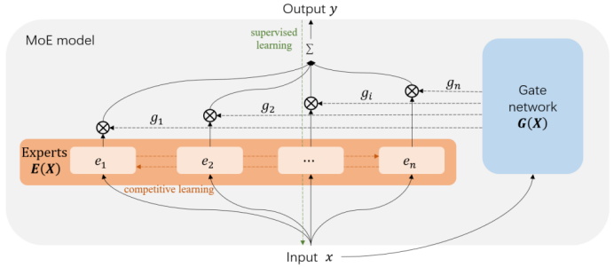
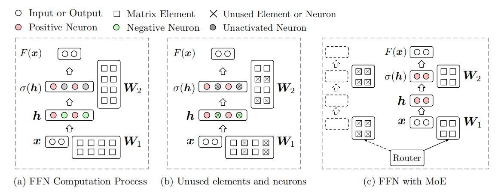

# 基于混合专家的模型推理加速方法的设计与实现
2023.7.15
## 选题背景
混合专家(Mixture-of-Experts)的发展脉络可以追溯到上世纪90年代，由Jacobs等人提出。
它的核心思想是将输入数据分配给不同的专家模型，每个模型专注于处理特定类型或特征的数据子集。
这些专家模型可以是任何机器学习或统计模型，如神经网络。然后，通过一个门控模型来根据输入数据的特征选择合适的专家模型，并将它们的预测结果进行加权组合，生成最终的预测结果。

从如今关于多尺度模型和可解释性等研究中我们可以发现，对于模型的不同子结构，比如层或者分支可以学习到多种特征。
这说明对一个既定目标，比如翻译，我们可以使用一种分治思想将原问题分解为多个子问题。

近年来，基于Transformers的预训练语言模型（PLMs）的规模呈指数级增长，但是根据我们对Transformer中FFN的观察，我们发现了一种稀疏激活的现象，即只有一小部分神经元为单个输入被激活。通过混和专家，将原本模型中的维度较宽一层的划分为多个维度较小的专家网络，可以有效地减少参数量，达到提高效率的目的。

## 模型结构
混合专家模型主要由两部分组成：专家网络（橙色）以及门控网络（蓝色），其计算可以被公式化为
$$
y = E(x) \cdot G(x) = \sum_{i}^{n} e_i(x)g_i(x)
$$
其中E()是专家网络的输出，G()是门控网络的输出​，ei(x)和gi(x)则分别对应了专家和门控网络第i个位置的输出，并且门控网络和专家接收相同的输入。



MoE模型可以被视为一种带门控的多分支网络，其中每个分支都被称作一个专家，专家和门控网络接收相同的输入，每个专家学习不同的特征，门函数根据输入为每个专家分配不同的权重。从结构的角度来说，MoE模型有两个本质问题，分别为专家划分和专家选择。


## 任务1 稀疏性验证


对于隐层表示中负值的所对应那部分参数实际上并没有被激活，因为在经过激活函数之后被设置为0，那么这部分没有被激活的参数到底占据了百分之多少？
```bash
python analyze_activation_rate.py
```
## 任务2 构建专家网络
如何选择专家的数量或者是每个专家的隐层维度

早期工作普遍从算法角度设计网络的监督学习过程，期望通过设计学习算法使得模型学习到更好的子问题划分方式，而在如今的混合专家模型中，普遍采用预定义好的专家数量。
在这个任务中，我们需要做的就是将一个Transformer中的一层FFN分成几个专家。

专家构建的核心思想是将通常同时被激活的神经元组合在一起。这样，我们就可以选择少量的专家来尽量覆盖所有被激活的神经元。

共激活图。为每个FFN建立了一个共激活图，其中节点是神经元，边缘权值被设置为两个神经元共同激活的次数。然后，我们通过图的划分将这个图划分为几个具有很强内部连接的子图（Karypis和Kumar，1998），并将每个子图视为专家。

聚类拆分。为了考虑参数信息，我们将FFN中的W矩阵的列视为具有ddodel维数的向量集合。然后，我们将平衡[k-means](https://github.com/ndanielsen/Same-Size-K-Means)应用到这个集合中，通过k个聚类来构造专家。在这种情况下，我们假设相似的神经元将同时被激活。
```bash
# 构建共激活图
python makeGraph.py
```

## 任务3 构建门控网络
如何选择专家的数量或者是每个专家的隐层维度

即门函数的输出，其可以是一种概率分布，也可以是一个Top-K函数的输出。这决定了MoE模型的最终输出是专家的集成还是仅使用少数专家的输出结果，即MoE模型是一个稠密的集成模型还是一个稀疏模型。

选择专家的核心理念是用有限的专家提供尽可能多的积极活

为了实现这一目标，我们首先通过贪婪算法在训练数据上找到最佳选择，然后利用它们训练一个浅层网络作为专家路由器，基于输入表示选择专家。

```bash
# 生成训练门控网络（controlNN）的数据集
python makeLabel.py
# 训练门控网络
python controlNN/train.py
```